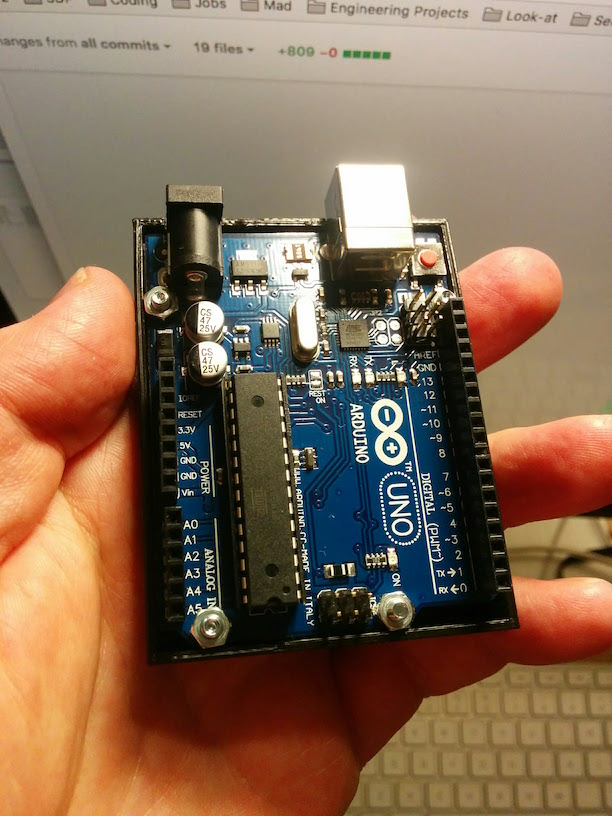

# Arduino Trays (SCAD and STL)

Trays for mounting Arduino's, so the back surface is protected while the top is still exposed for tinkering.

 

Can also be found at [Thingiverse](http://www.thingiverse.com/thing:2133227).

License: [Creative Commons - Attribution - Non Commercial - Share Alike](https://creativecommons.org/licenses/by-nc-sa/4.0/)
